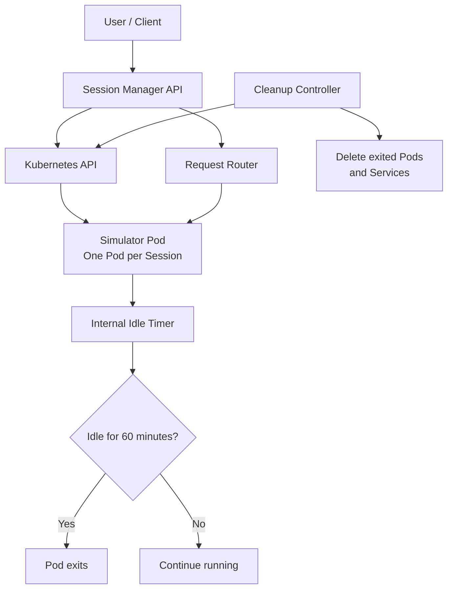
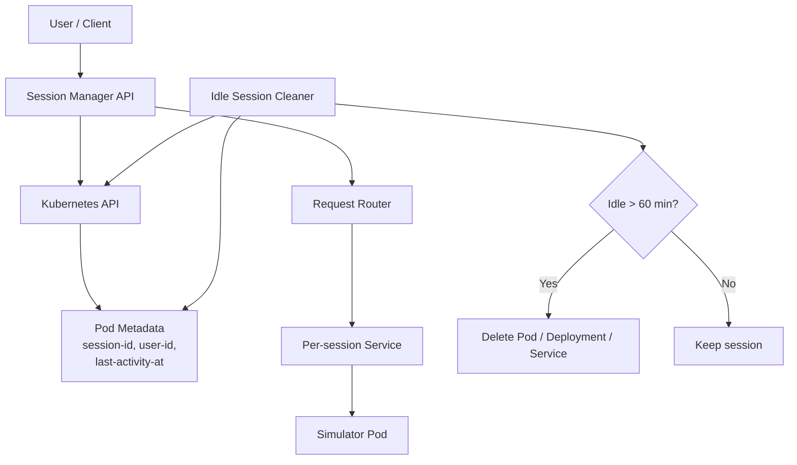
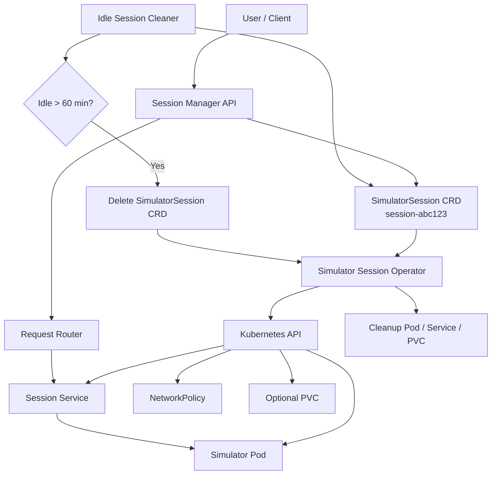

# Simulator Session Architecture Options for Kubernetes

## Goal

We need to run one simulator applet instance per user session.

The user should be able to:

```text
1. Create a session
2. Send requests to the simulator applet
3. Restart the session
4. Have the session expire after 60 minutes of idle time
```

We want to evaluate three Kubernetes-based solutions.

---

# Solution 1: No Session DB — Pod Self-Idle Shutdown

## Summary

In this model, each user session is represented by one simulator Pod.

There is no external session database. The Pod itself tracks activity. If the Pod receives no request for 60 minutes, it exits. A cleanup controller removes completed Pods and related Kubernetes resources.

## Architecture



## Session lifecycle

```text
Create session:
- Session Manager creates a new Pod.
- Pod name or labels contain session ID and user ID.

Send request:
- Session Manager routes request to the session Pod.
- Pod updates its own in-memory lastActivityAt timestamp.

Idle timeout:
- Pod checks its own idle time.
- If idle for 60 minutes, Pod exits.

Cleanup:
- Cleanup controller deletes exited Pods and related Services.

Restart:
- Session Manager deletes the old Pod.
- Session Manager creates a new Pod for the same session ID or a new generation.
```

## Example metadata

```yaml
metadata:
  name: simulator-session-abc123
  labels:
    app: simulator
    simulator.example.com/session-id: abc123
    simulator.example.com/user-id: user-42
    simulator.example.com/generation: "1"
  annotations:
    simulator.example.com/created-at: "2026-06-19T10:00:00Z"
    simulator.example.com/ttl-seconds-idle: "3600"
```

## Pros

```text
- No Redis/Postgres required.
- Very simple MVP.
- No frequent writes to Kubernetes API for lastActivityAt.
- Session existence maps directly to Pod existence.
- Easy restart: delete and recreate Pod.
```

## Cons

```text
- Session state is mostly inside the Pod.
- If Pod crashes, session state may be lost unless stored elsewhere.
- Harder to query active sessions with rich filtering.
- Cleanup and routing still need careful implementation.
- Not ideal if business needs audit history or reporting.
```

## Best fit

Use this if:

```text
- Simulator state can live inside the Pod.
- Losing the session on Pod crash is acceptable.
- We want the simplest no-database design.
- We expect moderate scale.
```

## Recommendation

This is the best first option for MVP if we want to avoid a session database.

---

# Solution 2: Pod / Deployment per Session with Kubernetes Metadata

## Summary

In this model, each user session is represented by a Pod or Deployment. Kubernetes metadata is used as the session registry.

Unlike Solution 1, the Session Manager owns the session activity tracking by updating Pod annotations such as `last-activity-at`.

## Architecture



## Session lifecycle

```text
Create session:
- Session Manager creates Pod or Deployment.
- Labels store session ID, user ID, generation.
- Annotations store createdAt, lastActivityAt, TTL.

Send request:
- Session Manager finds the Pod by name or label.
- Request is forwarded to the simulator.
- Session Manager patches lastActivityAt annotation.

Idle timeout:
- Cleanup controller lists simulator Pods.
- It checks the lastActivityAt annotation.
- If idle for more than 60 minutes, it deletes the Pod and Service.

Restart:
- Delete the old Pod or Deployment.
- Create a new one with generation incremented.
```

## Example metadata

```yaml
metadata:
  name: simulator-session-abc123
  labels:
    app: simulator
    simulator.example.com/session-id: abc123
    simulator.example.com/user-id: user-42
    simulator.example.com/generation: "1"
  annotations:
    simulator.example.com/status: "running"
    simulator.example.com/created-at: "2026-06-19T10:00:00Z"
    simulator.example.com/last-activity-at: "2026-06-19T10:23:00Z"
    simulator.example.com/ttl-seconds-idle: "3600"
```

## Pros

```text
- No separate session database.
- Kubernetes metadata is the source of truth.
- Easier to inspect sessions with kubectl.
- Cleaner than pure in-Pod state if we need external visibility.
- Restart and cleanup are straightforward.
```

## Cons

```text
- Updating lastActivityAt on every request creates Kubernetes API writes.
- Kubernetes API should not become a high-QPS session database.
- Needs rate-limiting or batching of metadata updates.
- Querying by timestamp is not efficient; cleaner must list/watch and evaluate timestamps.
```

## Optimization

Do not patch metadata on every request.

Instead:

```text
- Patch lastActivityAt at most once per 30–60 seconds per session.
- Keep exact request activity inside the Session Manager memory.
- Use Kubernetes annotation as approximate idle tracking.
```

## Best fit

Use this if:

```text
- We want no Redis/Postgres.
- We need better external visibility than Solution 1.
- Request volume is not very high.
- Approximate lastActivityAt updates are acceptable.
```

## Recommendation

This is a good intermediate solution, but we should be careful not to overload the Kubernetes API with frequent metadata writes.

---

# Solution 3: SimulatorSession CRD + Kubernetes Operator

## Summary

In this model, we create a custom Kubernetes resource called `SimulatorSession`.

The Session Manager creates and updates `SimulatorSession` objects. A dedicated Kubernetes Operator watches those objects and creates the required Pods, Services, NetworkPolicies, and optional storage.

This is the most production-grade option.

## Architecture



## Example custom resource

```yaml
apiVersion: simulator.example.com/v1
kind: SimulatorSession
metadata:
  name: session-abc123
spec:
  userId: user-42
  ttlSecondsAfterIdle: 3600
  image: simulator:1.0.0
  restartGeneration: 1
  resources:
    cpu: "1"
    memory: "2Gi"
status:
  phase: Running
  podName: simulator-session-abc123
  serviceName: simulator-session-abc123
  lastActivityAt: "2026-06-19T10:23:00Z"
```

## Session lifecycle

```text
Create session:
- Session Manager creates SimulatorSession CRD.
- Operator creates Pod, Service, and related resources.
- Operator updates CRD status.

Send request:
- Session Manager routes request to the Service.
- Activity can be tracked in CRD status, Pod annotation, or external lightweight cache.

Idle timeout:
- Cleaner or Operator checks lastActivityAt.
- If idle for more than 60 minutes, it deletes the SimulatorSession CRD.
- Operator removes all related resources.

Restart:
- Session Manager increments restartGeneration.
- Operator detects the change.
- Operator recreates the simulator Pod.
```

## Pros

```text
- Best lifecycle management.
- Clean Kubernetes-native abstraction.
- Easier to add quotas, policies, audit, and tenant controls.
- Clear separation between desired state and actual resources.
- Best fit for production and platform ownership.
```

## Cons

```text
- More engineering effort.
- Requires building and maintaining an Operator.
- More complex than MVP options.
- Still need to decide where high-frequency activity data lives.
```

## Best fit

Use this if:

```text
- Simulator sessions are a core platform capability.
- We expect many sessions and multiple teams.
- We need strong lifecycle, governance, observability, and cleanup.
- We want a long-term Kubernetes-native design.
```

---

# Comparison

| Area                  | Solution 1: Pod Self-Idle | Solution 2: Pod Metadata          | Solution 3: CRD + Operator         |
| --------------------- | ------------------------- | --------------------------------- | ---------------------------------- |
| Session DB needed     | No                        | No                                | No or optional                     |
| Complexity            | Low                       | Medium                            | High                               |
| Kubernetes API writes | Low                       | Medium/High                       | Medium                             |
| Idle handling         | Inside Pod                | Cleaner checks metadata           | Operator/Cleaner handles lifecycle |
| Restart               | Delete/recreate Pod       | Delete/recreate Pod or Deployment | Update CRD generation              |
| Visibility            | Medium                    | Good                              | Very good                          |
| Production readiness  | Medium                    | Medium                            | High                               |
| Best use              | MVP                       | Intermediate                      | Long-term platform                 |

---

# Recommended path

## Phase 1: Start with Solution 1

Use Pod self-idle shutdown.

This gives us:

```text
- No session database
- Simple lifecycle
- Low Kubernetes API write pressure
- Easy restart behavior
- Fast MVP delivery
```

## Phase 2: Move to Solution 2 if visibility is needed

If the team needs to inspect and manage sessions from Kubernetes metadata, add labels and annotations and a cleanup controller.

## Phase 3: Move to Solution 3 for production platform

If this becomes a core product capability, implement `SimulatorSession` CRD and a Kubernetes Operator.

---

# Final recommendation

Start with:

```text
Solution 1: No Session DB — Pod Self-Idle Shutdown
```

Design the labels, naming, and lifecycle in a way that does not block moving later to:

```text
Solution 3: SimulatorSession CRD + Operator
```

This gives us a simple MVP now and a clean production path later.
